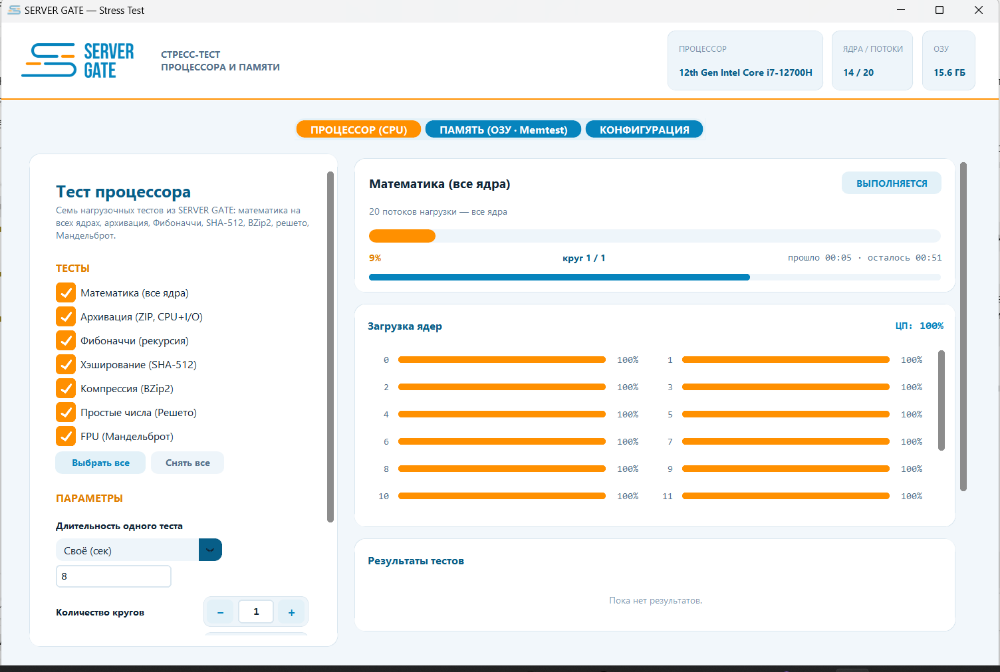
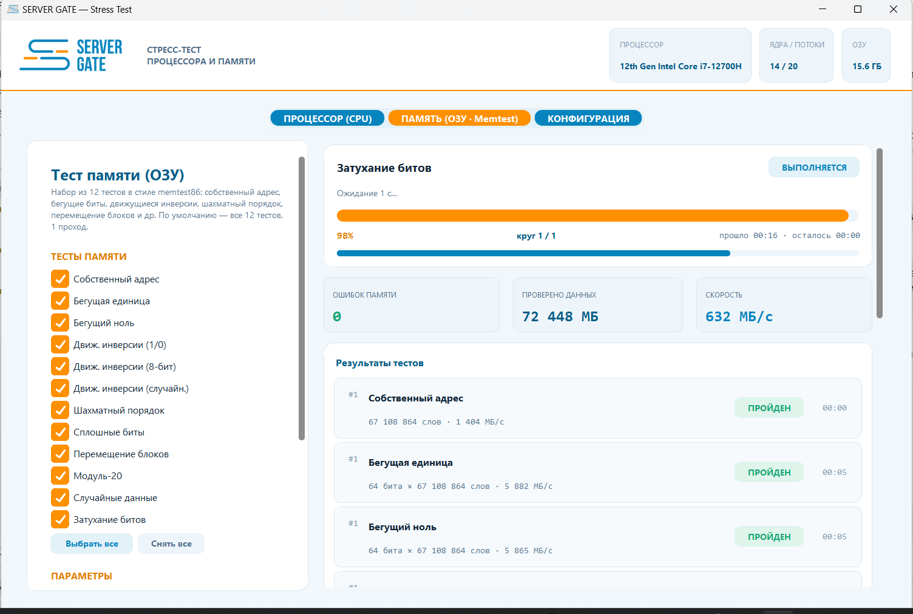
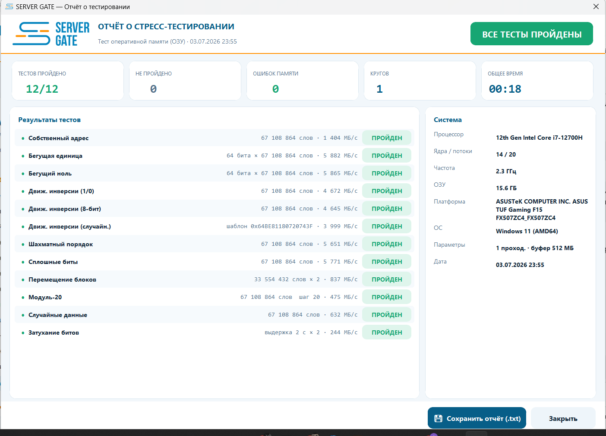
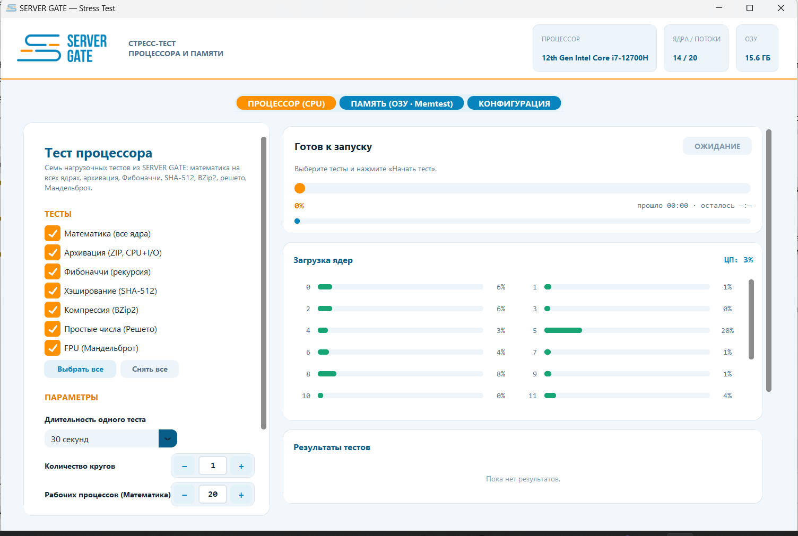
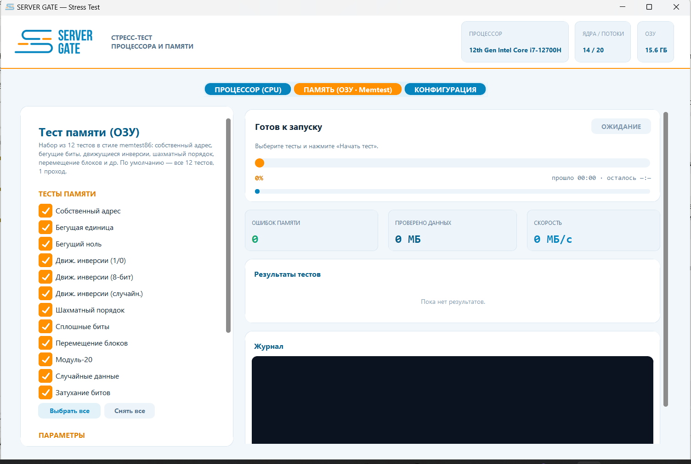
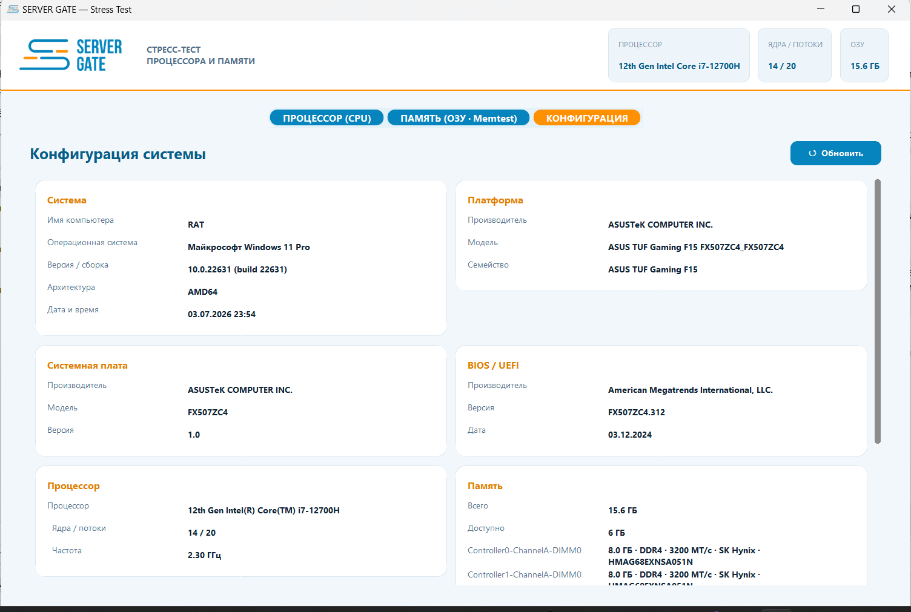
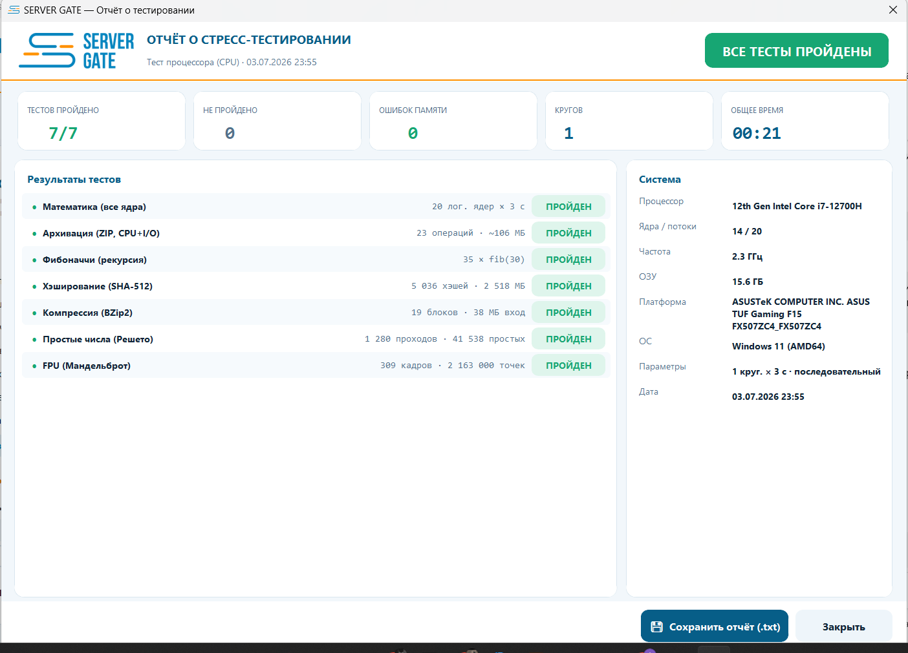

<p align="center">
  
</p>

<h1 align="center">SERVER GATE — Stress Test</h1>

<p align="center">
  <b>Open-source CPU &amp; RAM burn-in suite for servers and PCs</b><br>
  7 CPU torture tests · 12 memtest86-style memory tests · multi-socket detection ·
  AIDA-like hardware passport · client-ready one-screen report · bootable Live ISO
</p>

<p align="center">
  <a href="../../releases/latest/download/ServerGate_StressTest_GUI.exe">
    </a>
  <a href="#-bootable-iso-for-servers-via-ventoy">
    </a>
</p>

<p align="center">
  
  
  
  
  
</p>

---

## 🔥 See it in action

**All 20 threads pinned at 100% during the all-core math test:**



**memtest86-style RAM testing — live error counter, data volume and throughput:**



**The result your client actually understands — everything on one screen:**



<details>
<summary><b>📸 More screenshots — CPU tab, RAM tab, system configuration, CPU report</b></summary>

| CPU test setup | RAM test setup |
|---|---|
|  |  |

| System configuration (AIDA-like) | CPU report |
|---|---|
|  |  |

</details>

## ✨ Why SERVER GATE?

|  | SERVER GATE | memtest86 | Prime95 | OCCT |
|---|:---:|:---:|:---:|:---:|
| CPU **and** RAM testing in one tool | ✅ | — | CPU only | ✅ |
| Modern GUI with live per-core monitoring | ✅ | — | — | ✅ |
| Bootable ISO (test servers without an OS) | ✅ | ✅ | — | — |
| Client-ready one-screen report | ✅ | — | — | — |
| Multi-socket CPU detection (`Xeon Gold 6254 ×2`) | ✅ | ✅ | — | partial |
| Hardware passport (AIDA-like) | ✅ | — | — | partial |
| Free for commercial use | ✅ MIT | limited | ✅ | paid |
| Open source | ✅ | — | partial | — |

> Honest note: firmware-level memtest86 tests physical memory below the OS and remains
> the gold standard for deep RAM diagnostics. SERVER GATE runs the same classic
> algorithms from userspace — in the Live ISO nearly all physical RAM is available
> to the test — and adds everything around it: CPU burn-in, monitoring, reporting.

### Feature list

- **7 CPU stress tests** — all-core transcendental math (multiprocess), ZIP archiving
  (CPU+I/O), deep Fibonacci recursion, SHA-512 hashing, BZip2 compression, Sieve of
  Eratosthenes, Mandelbrot FPU torture. Sequential or **all-at-once "extreme" mode**,
  duration presets 30 s … 3 h, configurable rounds.
- **12 memtest86-style RAM tests** — own address, walking ones/zeros, moving inversions
  (1/0 · 8-bit · random), checkerboard, solid bits, block move, modulo-20,
  pseudo-random compare, bit-fade retention. Live error counter, MB/s throughput,
  configurable buffer and passes.
- **Multi-socket detection** — dual/quad-CPU servers shown as `Intel Xeon Gold 6254 ×2`
  with per-package cores/threads/frequency.
- **System configuration tab** — platform, motherboard, BIOS/UEFI + boot mode,
  every RAM module (size · type · speed · vendor · part number), drives, GPUs, network.
- **One-screen report** — verdict, summary tiles, all tests with metrics; fits a single
  screenshot for the client. Detailed per-round log exports to `.txt`.
- **Bootable Live ISO** — Ventoy-ready, BIOS + UEFI, Secure Boot friendly, GUI starts
  fullscreen automatically.

## 🚀 Quick start

### Windows (portable)
**[⬇ Download ServerGate_StressTest_GUI.exe](../../releases/latest/download/ServerGate_StressTest_GUI.exe)** — single file, no installation. Windows 10/11 x64.

### Run from source (Windows / Linux)
```bash
git clone https://github.com/xauskis/servergate-stress-test.git
cd servergate-stress-test
pip install -r requirements.txt
python app/main.py
```

### 🖥 Bootable ISO for servers (via Ventoy)
The ISO is ~3.3 GB (over GitHub's release limit), so you build it yourself —
one command, ~20 minutes, on any Debian/Ubuntu machine (WSL2 works):

```bash
cd iso
sudo ./build_iso.sh          # → build/servergate.iso  (BIOS + UEFI, isohybrid)
```

Drop `servergate.iso` onto your Ventoy stick, boot the server (HPE ProLiant:
**F11** boot menu), pick the ISO — the GUI opens fullscreen automatically and
nearly all physical RAM is available to the memory test.

## ❓ FAQ

<details>
<summary><b>Does the ISO work with Secure Boot?</b></summary>
Yes. The remaster keeps Debian's signed shim/GRUB/kernel chain untouched — only the
userland squashfs is modified. No BIOS settings need to be changed.
</details>

<details>
<summary><b>Ventoy shows the ISO but it doesn't boot?</b></summary>
Rare, but if it happens press <b>F6</b> in Ventoy and try another boot mode
(grub2 / normal). The image is also a valid raw USB image — you can write it
directly with Rufus/dd.
</details>

<details>
<summary><b>Live system credentials?</b></summary>
Standard Debian Live: user <code>user</code>, password <code>live</code>,
passwordless <code>sudo</code>. Login is automatic.
</details>

<details>
<summary><b>How do I save the report from the Live ISO?</b></summary>
Plug in a second USB stick — it mounts automatically in the live session —
and save the <code>.txt</code> report there.
</details>

<details>
<summary><b>Is the GUI available in English?</b></summary>
The UI is currently Russian (built for RU server-service workflows).
PRs adding i18n are very welcome.
</details>

## 🔧 Building the Windows exe

```bash
pip install -r requirements.txt pyinstaller
cd app
pyinstaller --noconfirm --onefile --windowed --name ServerGate_StressTest_GUI ^
  --icon servergate.ico --collect-all customtkinter ^
  --add-data "logo_header.png;." --add-data "logo_report.png;." ^
  --add-data "logo_icon.png;." --add-data "servergate.ico;." main.py
```

## 🇷🇺 Кратко по-русски

**SERVER GATE Stress Test** — открытый инструмент прожига серверов и ПК:
7 CPU-тестов, 12 тестов ОЗУ в стиле memtest86, определение многопроцессорных
конфигураций (×2/×4), паспорт системы как в AIDA и отчёт в одно окно — клиент
видит результат на одном скриншоте. Portable-exe для Windows — в
[Releases](../../releases); загрузочный ISO для Ventoy собирается одной командой
`sudo ./iso/build_iso.sh`. Лицензия MIT — можно свободно использовать в
коммерческом сервисе.

## 🤝 Contributing

Issues and PRs are welcome: i18n (EN interface), new test patterns, packaging.
If this tool saved you an RMA dispute — **give it a star ⭐**, it helps others find it.

## 📄 License

Code is released under the [MIT License](LICENSE).
The SERVER GATE name and logo are the property of [servergate.ru](https://servergate.ru).
